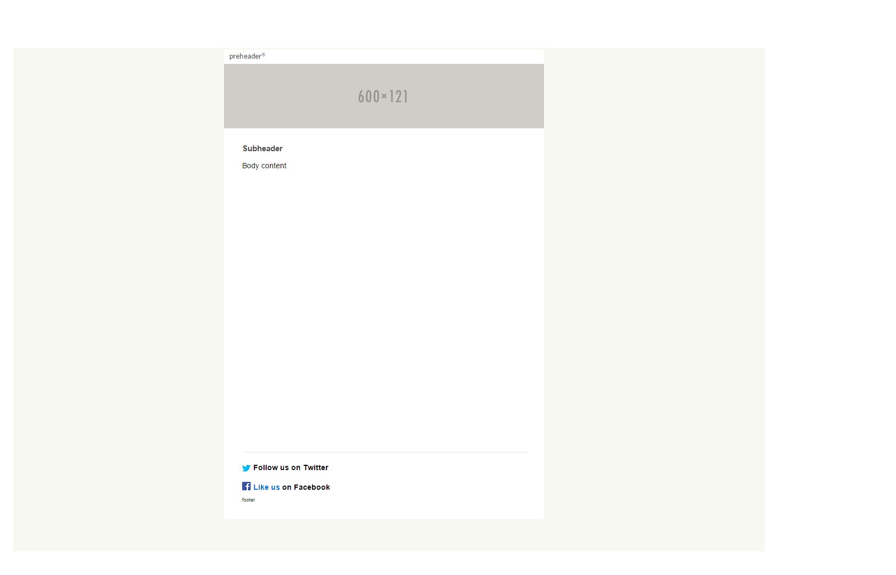

This is a basic template for responsive design based off of email design comps that are most common, and is used in all the other templates of this library. The background-color on the window is just used for testing, and should be changed to #ffffff (white) for delivery.

