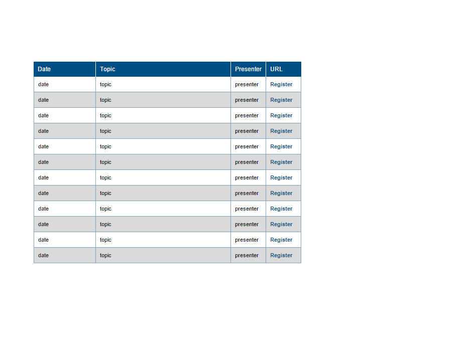
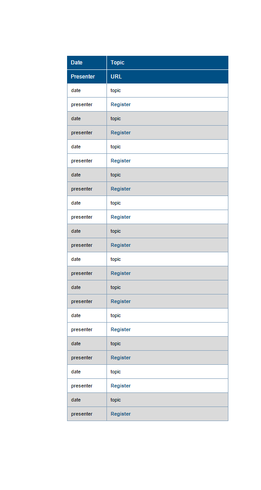

How do you create a responsive table for an html email?

The short answer: Create the table within another table that has a responsive width set to 100% of the body element, which would have say about 600px maximum width.

But eventually the screen width gets to a point where the width of your table data elements becomes too narrow. This is where progressive enhancement comes in: Build two tables so that by default the first table always displays `table.bigshow` and the second table `
<table></table>
` will display when the screen width is less than the breakpoint.

When the screen width is less than 520px (for smartphones primarily) we want the last two elements of each row to collapse underneath the first two  elements of each row.  The rows on both tables alternate their background color, so when the tables collapse, it's easy to recognize that the data is grouped together.

    @media only screen and (max-width: 520px) {
      .bigHide{
        display:block !important;
        max-height:none !important;
        overflow:visible !important;
      }
      .bigShow{
        display:none !important;
        max-height:0px !important;
        overflow:hidden !important;
      }
    }

The `table.bigShow ` will display by default until the screen width is less than 520px.

However Outlook, Internet Explorer, and Gmail don't support media queries.  Well, Outlook isn't an issue here because the desktop client will look fine and the Outlook app on smart phones is supported with webkit so media queries work fine.

But Gmail wipes out any style tags.  All css has to be inline.  So, the styles that get overrode when the screen width gets below 520px need to be applied to the `table.bigShow`, and then the table that will show for the smaller screens needs to be wrapped around a `div.bigHide`.  This will keep the smaller table from showing up on the desktop screens.

